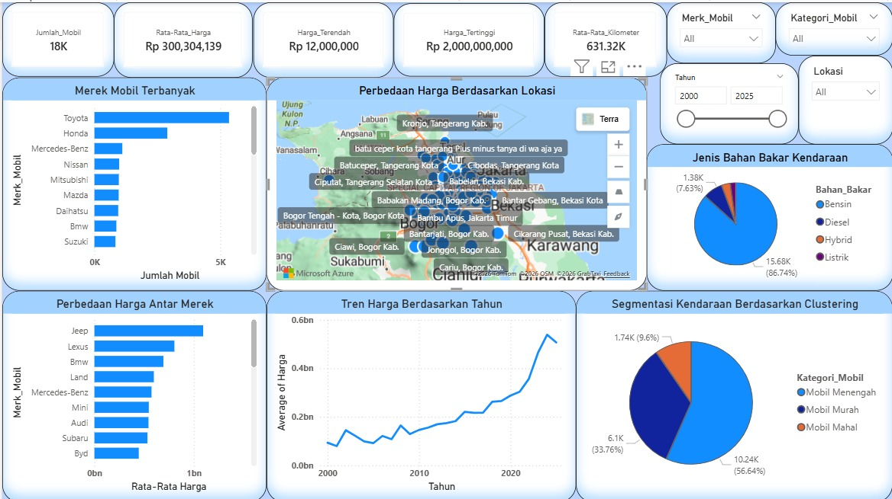

# Used Car Market Analysis Dashboard (Greater Jabodetabek)

Business Intelligence Dashboard for analyzing the used car market based on OLX advertisement data in the Greater Jakarta area (Jakarta, Bogor, Depok, Tangerang, and Bekasi).

## Project Overview

This project was developed as my undergraduate thesis in the Information Systems program. It integrates web scraping, data preprocessing, machine learning, data warehousing, and business intelligence to analyze the used car market and present actionable insights through an interactive Power BI dashboard.

---

## Key Features

- Web Scraping of OLX Used Car Listings
- Data Cleaning & Preprocessing
- K-Means Clustering for Market Segmentation
- SQL Data Warehouse (Star Schema)
- KPI Design & Business Metrics
- Interactive Dashboard with Microsoft Power BI
- Responsive Website Integration (HTML & CSS)

---

## Project Workflow

```
Web Scraping
      │
      ▼
Data Cleaning
      │
      ▼
Feature Engineering
      │
      ▼
K-Means Clustering
      │
      ▼
SQL Data Warehouse
      │
      ▼
KPI Development
      │
      ▼
Power BI Dashboard
      │
      ▼
Website Deployment
```

---

## Technologies

- Python
- Pandas
- NumPy
- Scikit-learn
- Microsoft SQL Server
- Microsoft Power BI
- HTML
- CSS
- Git
- GitHub

---

## Repository Structure

```
Dashboard/
Data/
Python/
SQL/
Website/
```

---

## Dashboard Preview

[](https://dashboardolxjabodetabek.netlify.app/)

---

## Live Dashboard

https://dashboardolxjabodetabek.netlify.app/

---

## Research Publication

https://jurnal.itbsemarang.ac.id/index.php/JPSI/article/view/4078

---

## Author

**Dio Faturamdani**

Bachelor of Information Systems

Aspiring Data Analyst | Business Intelligence Analyst

**Skills**

- Python
- SQL
- Power BI
- Data Analytics
- Machine Learning
- Data Visualization
